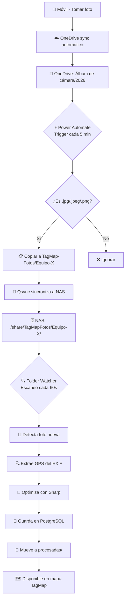

# Integración OneDrive + Power Automate + QNAP NAS

Guía completa para configurar Power Automate para que las fotos de los trabajadores se suban automáticamente desde OneDrive al NAS QNAP y sean importadas por el Folder Watcher de TagMap.

---

## Arquitectura del flujo

```
📱 Móvil del trabajador
    ↓ OneDrive app (sincronización automática de cámara)
☁️  OneDrive (Mis imágenes > Álbum de cámara > 2026)
    ↓ Power Automate (detecta archivo nuevo)
🗄️  QNAP NAS (/share/TagMapFotos/Equipo-X/)
    ↓ Folder Watcher (escaneo cada 60s)
💾 Base de datos TagMap
    ↓
🗺️  Visualización en mapa
```

---

## Requisitos previos

### 1. Configuración del NAS QNAP

**1.1 Habilitar SMB/CIFS**

1. Panel de Control → **Panel de control** → **Privilegios** → **Carpetas compartidas**
2. Selecciona `TagMapFotos`
3. **Editar permisos de carpeta compartida**
4. En **Configuración de Microsoft Networking**, marca:
   - ✅ Habilitar acceso SMB
   - ✅ Permitir acceso de invitados (NO recomendado, mejor crear usuario específico)

**1.2 Crear usuario para Power Automate**

1. Panel de Control → **Privilegios** → **Usuarios**
2. **Crear** → **Crear un usuario**
   - Nombre de usuario: `powerautomate`
   - Contraseña: (anótala, la necesitarás)
3. En **Carpetas compartidas**, asigna permisos:
   - `TagMapFotos` → ✅ RW (lectura/escritura)
4. **Aplicar**

**1.3 Anotar información del NAS**

Necesitarás:
- IP del NAS en red local: `192.168.1.100` (ejemplo)
- Nombre de host: `\\QNAP-NAS` o `\\192.168.1.100`
- Usuario: `powerautomate`
- Contraseña: `TuPasswordSegura123!`
- Carpeta compartida: `TagMapFotos`

### 2. Estructura de carpetas en el NAS

Las carpetas de equipos ya deben existir en `/share/TagMapFotos/`:

```
TagMapFotos/
  ├── Equipo-Norte/
  ├── Equipo-Sur/
  └── Equipo-Centro/
```

> **Importante:** Cada trabajador debe saber a qué equipo pertenece. Esto define en qué carpeta irán sus fotos.

### 3. Mapeo trabajadores → equipos

Define qué trabajador pertenece a qué equipo:

| Trabajador       | Email OneDrive           | Carpeta NAS       |
|------------------|--------------------------|-------------------|
| Juan Pérez       | juan@empresa.com         | Equipo-Norte      |
| María García     | maria@empresa.com        | Equipo-Sur        |
| Carlos López     | carlos@empresa.com       | Equipo-Centro     |

---

## Acceso al OneDrive de trabajadores (solo para admins)

Como administrador de Microsoft 365, tienes varias formas de acceder al OneDrive de los trabajadores para verificar la estructura de carpetas o configurar flujos.

### Método 1 — Centro de administración de Microsoft 365 (RECOMENDADO)

**Acceso temporal a archivos:**

1. Ve a [admin.microsoft.com](https://admin.microsoft.com)
2. **Usuarios** → **Usuarios activos**
3. Busca y selecciona al trabajador (ej. "Juan Pérez")
4. Haz clic en la pestaña **OneDrive**
5. Haz clic en **Obtener acceso a archivos**
   - Duración por defecto: 1 hora (puedes cambiarla)
   - Esto te da permisos de lectura/escritura temporales
6. Aparecerá un enlace directo a su OneDrive
7. Haz clic en **Abrir OneDrive** → se abre en nueva pestaña

Ahora puedes ver su OneDrive como si fueras el usuario, pero desde tu sesión de admin.

### Método 2 — SharePoint Admin Center

**Acceso permanente (hasta que lo revoque):**

1. Ve a [admin.microsoft.com/sharepoint](https://admin.microsoft.com/sharepoint)
2. **Más características** → **Sitios activos** (en "Administración clásica")
3. Busca el OneDrive del usuario:
   - Nombre: `OneDrive - Juan Pérez`
   - URL: `https://tuempresa-my.sharepoint.com/personal/juan_empresa_com`
4. Selecciona la fila (checkbox) → **Permisos**
5. **Agregar administradores del sitio**
6. Añade tu cuenta: `admin@empresa.com`
7. **Guardar**

Ahora puedes acceder directamente a esa URL cuando quieras.

### Método 3 — Solicitar acceso compartido (menos invasivo)

**Más respetuoso con la privacidad:**

1. Pide al trabajador que comparta su carpeta `Mis imágenes/Álbum de cámara` contigo
2. El trabajador:
   - OneDrive web → navega a `Mis imágenes`
   - Botón derecho en `Álbum de cámara` → **Compartir**
   - Añade tu email de admin
   - Permiso: **Puede editar** (necesario para Power Automate)
3. Recibirás un email con acceso
4. La carpeta aparecerá en tu OneDrive en "Compartido conmigo"

### Verificar estructura de carpetas

Una vez tengas acceso, verifica que existe:

```
OneDrive del trabajador/
  └── Mis imágenes/  (o "Pictures" en inglés)
      └── Álbum de cámara/  (o "Camera Roll")
          └── 2026/
              ├── IMG_20260101_123456.jpg
              ├── IMG_20260102_234567.jpg
              └── ...
```

**⚠️ Importante:** Si usas Windows Phone o la app de OneDrive en Android/iOS, la sincronización automática de cámara crea esta estructura por defecto. Si no existe, el trabajador debe:

1. Instalar OneDrive en el móvil
2. Iniciar sesión con su cuenta de trabajo
3. **Configuración** → **Carga de cámara** → **Activar**
4. Seleccionar: Solo WiFi o Siempre (según preferencia)

---

## Configuración de Power Automate

### Opción A — Un flujo por trabajador (recomendado para 2-10 trabajadores)

Cada trabajador tiene su propio flujo personalizado que sube a su carpeta de equipo específica.

### Opción B — Un flujo genérico (para 10+ trabajadores)

Usa una tabla Excel compartida que mapea email → carpeta de equipo.

**Para tu caso (2 trabajadores), usa Opción A.**

---

## Paso 1 — Crear flujo para el primer trabajador

### 1.1 Acceder a Power Automate

1. Ve a [make.powerautomate.com](https://make.powerautomate.com)
2. Inicia sesión con tu cuenta de admin de Microsoft 365

### 1.2 Crear flujo automático

1. **Crear** → **Flujo de nube automatizado**
2. Nombre del flujo: `OneDrive → NAS - Juan Pérez (Equipo-Norte)`
3. Desencadenador: busca **"Cuando se crea un archivo"**
4. Selecciona: **OneDrive for Business - Cuando se crea un archivo**
5. **Crear**

### 1.3 Configurar el trigger

**Cuando se crea un archivo (OneDrive for Business)**

**⚠️ IMPORTANTE - Autenticación del trabajador:**

Al configurar el trigger, Power Automate pedirá que selecciones una **conexión a OneDrive**. Aquí tienes dos opciones:

**Opción 1 - Usar credenciales del trabajador (RECOMENDADO):**
1. En el trigger, cuando pida "Conexión", haz clic en **+ Agregar nueva conexión**
2. Introduce las credenciales del trabajador:
   - Email: `juan@empresa.com`
   - Contraseña: (pide al trabajador que te la dé temporalmente)
3. Autorizar → ahora el flujo tiene acceso a su OneDrive
4. **Importante:** Cambia la contraseña del trabajador después (por seguridad)

**Opción 2 - Usar tu cuenta de admin con acceso temporal:**
1. Obtén acceso temporal al OneDrive del trabajador (ver sección "Acceso al OneDrive de trabajadores" arriba)
2. En el trigger, selecciona tu conexión de admin
3. El flujo se ejecutará con tus permisos (tiene acceso porque obtuviste permisos temporales)
4. **Limitación:** Si revocas tu acceso, el flujo dejará de funcionar

**Configuración del trigger:**

1. **Folder:** Haz clic en el icono de carpeta 📁
   
   - Si usaste credenciales del trabajador: verás su OneDrive directamente
   - Si usas tu admin con acceso: verás "Archivos de otros usuarios" → selecciona Juan Pérez
   
   Navega a:
   ```
   Mis imágenes > Álbum de cámara > 2026
   ```
   
   > Si no ves "Álbum de cámara", escribe la ruta manualmente: `/Pictures/Camera Roll/2026`
   > 
   > **Nota:** En OneDrive en inglés, la ruta es `/Pictures/Camera Roll/2026`

2. **Include subfolders:** `No` (a menos que haya subcarpetas)

3. **Infer content type:** `Yes`

4. **How often do you want to check for items?** 
   - Intervalo: `5 minutos` (ajustable, mínimo 1 minuto con Premium)

### 1.4 Agregar filtro de tipo de archivo (opcional pero recomendado)

1. Debajo del trigger, haz clic en **+ Nuevo paso**
2. Busca **"Condición"**
3. Configura:
   ```
   Nombre del archivo termina con .jpg
   O
   Nombre del archivo termina con .jpeg
   O
   Nombre del archivo termina con .png
   ```

   Para hacerlo:
   - Campo: `File name` (contenido dinámico del trigger)
   - Operador: `ends with`
   - Valor: `.jpg`
   - **Agregar** (botón +) para añadir más condiciones con "O"

### 1.5 Obtener contenido del archivo

Dentro del bloque **Si es sí** de la condición:

1. **+ Agregar una acción**
2. Busca: **"OneDrive - Obtener contenido de archivo"**
3. **File Id:** Selecciona del contenido dinámico → `File identifier`

### 1.6 Copiar al NAS QNAP vía HTTP/REST

**⚠️ Problema:** Power Automate no tiene conector nativo para SMB/CIFS.

**Soluciones:**

#### Solución 1 — Script de PowerShell en el propio NAS (RECOMENDADO)

Power Automate llama a un webhook/API en el NAS que ejecuta un script PowerShell/Python que copia el archivo.

**Esto requiere:**
- Servidor web ligero en el NAS (Node.js, Python Flask, o PHP)
- Script que recibe la foto vía POST y la guarda en la carpeta correcta

**Ejemplo de endpoint en Node.js:**

```javascript
// api-receiver.js (ejecutar en el NAS)
const express = require('express');
const multer = require('multer');
const path = require('path');

const app = express();
const upload = multer({ dest: '/tmp/' });

app.post('/upload/:team', upload.single('photo'), (req, res) => {
  const team = req.params.team; // "Equipo-Norte"
  const file = req.file;
  const targetPath = `/share/TagMapFotos/${team}/${file.originalname}`;
  
  fs.renameSync(file.path, targetPath);
  
  res.json({ success: true, path: targetPath });
});

app.listen(8080, () => console.log('API escuchando en puerto 8080'));
```

**Desde Power Automate:**

1. **+ Agregar una acción**
2. Busca: **"HTTP - HTTP"**
3. Configura:
   - **Method:** `POST`
   - **URI:** `http://192.168.1.100:8080/upload/Equipo-Norte`
   - **Headers:**
     ```
     Content-Type: multipart/form-data
     ```
   - **Body:** `File Content` (del paso anterior)

#### Solución 2 — OneDrive compartido + sincronización Qsync (MÁS SIMPLE)

En lugar de Power Automate, usa la app **Qsync** del NAS para sincronizar una carpeta de OneDrive compartida.

**Flujo:**

1. Crea carpeta compartida en OneDrive: `TagMap-Fotos/Equipo-Norte/`
2. Power Automate mueve fotos de `Álbum de cámara` → `TagMap-Fotos/Equipo-Norte/`
3. Qsync (configurado en el NAS) sincroniza automáticamente `TagMap-Fotos/` → `/share/TagMapFotos/`

**Ventaja:** No necesitas programar API.

**Desventaja:** Requiere Qsync Client instalado en el NAS.

#### Solución 3 — Usar Azure Logic Apps con conector de archivos (PREMIUM)

Si tienes licencia Premium de Power Automate:

1. Instalar **Data Gateway** en un PC siempre encendido en la red local
2. Usar conector **File System** que soporta SMB
3. Copiar directamente a `\\192.168.1.100\TagMapFotos\Equipo-Norte\`

**Costo:** Requiere licencia Premium de Power Automate (~15 USD/mes por usuario).

---

## Paso 2 — Configuración con OneDrive compartido + Qsync (RECOMENDADO)

### 2.1 Crear carpetas compartidas en OneDrive

**Como admin:**

1. Ve a OneDrive web → **Mis archivos**
2. Crea carpeta: `TagMap-Fotos`
3. Dentro, crea subcarpetas:
   ```
   TagMap-Fotos/
     ├── Equipo-Norte/
     ├── Equipo-Sur/
     └── Equipo-Centro/
   ```
4. **Compartir** la carpeta `TagMap-Fotos` con todos los trabajadores (permiso de escritura)

### 2.2 Flujo de Power Automate por trabajador

**Para Juan Pérez (Equipo-Norte):**

1. **Trigger:** Cuando se crea un archivo en `/Pictures/Camera Roll/2026`
2. **Condición:** File name ends with `.jpg` OR `.jpeg` OR `.png`
3. **Acción:** OneDrive for Business → **Copiar archivo**
   - **File:** `File identifier` (del trigger)
   - **Destination folder:** `/TagMap-Fotos/Equipo-Norte`
   - **If file already exists:** `Fail` (evita duplicados)
4. **Acción:** OneDrive for Business → **Mover archivo** (opcional, para limpiar)
   - **File:** `File identifier`
   - **Destination folder:** `/Pictures/Camera Roll/Procesadas`

### 2.3 Instalar Qsync en el NAS

**Desde el NAS QNAP:**

1. **App Center** → busca **Qsync Central**
2. **Instalar**
3. Abrir Qsync Central
4. **Agregar cuenta de OneDrive**
   - Iniciar sesión con tu cuenta de admin de Microsoft
   - Autorizar acceso
5. **Configurar carpeta de sincronización:**
   - OneDrive: `/TagMap-Fotos`
   - NAS: `/share/TagMapFotos`
   - Modo: **Sincronización bidireccional** (o solo descarga)
6. **Aplicar**

Qsync ahora sincronizará automáticamente las fotos que Power Automate copie a `/TagMap-Fotos/` en OneDrive hacia el NAS.

### 2.4 Verificar sincronización

1. Sube una foto de prueba manualmente a OneDrive → `TagMap-Fotos/Equipo-Norte/`
2. Espera 30-60 segundos
3. Verifica en el NAS: `/share/TagMapFotos/Equipo-Norte/`
4. La foto debería aparecer allí

---

## Paso 3 — Crear flujo para el segundo trabajador

Tienes **dos opciones** para configurar flujos de los trabajadores:

### Opción A — Tú (admin) configuras todo

**Ventaja:** Control total, no depende de conocimientos técnicos del trabajador  
**Desventaja:** Necesitas acceso temporal a su OneDrive

**Pasos:**

1. **Obtener acceso al OneDrive del trabajador:**
   - Ve a [admin.microsoft.com](https://admin.microsoft.com) → **Usuarios activos**
   - Selecciona al trabajador (ej. María García)
   - Pestaña **OneDrive** → **Obtener acceso a archivos**
   - Esto te da acceso temporal (por defecto 1 hora, configurable)

2. **Verificar estructura de carpetas:**
   - Ve a OneDrive web con tu cuenta de admin
   - Navega al OneDrive del trabajador (aparecerá en "Compartido conmigo")
   - Verifica que existe la carpeta: `Mis imágenes > Álbum de cámara > 2026`
   - Si no existe, créala o espera a que el trabajador suba una foto primero

3. **Crear flujo con tu cuenta de admin:**
   - En Power Automate, crea nuevo flujo: `OneDrive → NAS - María García (Equipo-Sur)`
   - **Trigger:** Cuando se crea un archivo
   - **Folder:** Aquí selecciona OneDrive del trabajador (aparecerá si tienes acceso)
   - **IMPORTANTE:** El trigger pedirá autenticación - usa las credenciales del trabajador aquí
   - Completa el flujo como en Paso 2.2, cambiando destino a `Equipo-Sur`

4. **Compartir flujo con el trabajador (opcional):**
   - **Compartir** → añade email del trabajador como **Copropietario**
   - Así puede ver el estado y logs

### Opción B — El trabajador configura su propio flujo (RECOMENDADO)

**Ventaja:** No necesitas acceder a su OneDrive, más privado  
**Desventaja:** Requiere 10 minutos de formación al trabajador

**Pasos:**

1. **Crear plantilla del flujo:**
   - Exporta el flujo que creaste para el primer trabajador:
     - Power Automate → abrir flujo → **⋮** (menú) → **Exportar** → **Paquete (.zip)**
   - Guarda el archivo `.zip`

2. **Enviar plantilla al trabajador:**
   - Email con el archivo `.zip` adjunto
   - Incluye instrucciones (ver más abajo)

3. **Instrucciones para el trabajador:**

   ```
   Hola [Nombre],
   
   Para que tus fotos se suban automáticamente al sistema TagMap:
   
   1. Ve a https://make.powerautomate.com e inicia sesión con tu cuenta de trabajo
   2. Haz clic en "Mis flujos" → "Importar" → "Importar paquete (heredado)"
   3. Sube el archivo adjunto (flujo-tagmap.zip)
   4. En "Revisar contenido del paquete":
      - OneDrive for Business → "Seleccionar durante la importación" → elige tu OneDrive
   5. "Importar"
   6. Una vez importado, abre el flujo
   7. Edita estos valores:
      - Carpeta origen: /Pictures/Camera Roll/2026 (o donde están tus fotos)
      - Carpeta destino: /TagMap-Fotos/Equipo-Sur (¡importante! usa TU equipo)
   8. "Guardar"
   9. Activa el flujo (interruptor arriba a la derecha)
   
   ¡Listo! Tus fotos se subirán automáticamente.
   
   Saludos,
   [Tu nombre]
   ```

4. **Verificar que funciona:**
   - Pide al trabajador que suba una foto de prueba
   - Revisa en OneDrive compartido → `TagMap-Fotos/Equipo-Sur/`
   - Si aparece, Qsync la sincronizará al NAS

---

## Paso 4 — Probar el flujo completo

### 4.1 Probar con foto de prueba

**Desde el móvil del trabajador:**

1. Tomar una foto con el móvil (asegurar que GPS está activo)
2. Espera que OneDrive sincronice (1-2 minutos)
3. La foto aparece en: OneDrive web → `Mis imágenes/Álbum de cámara/2026`

**Power Automate debería activarse automáticamente en los próximos 5 minutos.**

### 4.2 Ver ejecución del flujo

1. Ve a [make.powerautomate.com](https://make.powerautomate.com)
2. **Mis flujos** → selecciona el flujo del trabajador
3. **Historial de ejecución de 28 días**
4. Deberías ver una ejecución reciente con estado **Succeeded**
5. Haz clic para ver detalles:
   - ✅ Trigger detectó el archivo
   - ✅ Condición se cumplió (.jpg)
   - ✅ Archivo copiado a `/TagMap-Fotos/Equipo-Norte/`

### 4.3 Verificar en OneDrive

La foto debería estar ahora en:
```
OneDrive → TagMap-Fotos/Equipo-Norte/nombre-foto.jpg
```

### 4.4 Verificar sincronización Qsync

1. Espera 30-60 segundos
2. Conéctate al NAS vía SSH o File Station
3. Verifica:
   ```
   /share/TagMapFotos/Equipo-Norte/nombre-foto.jpg
   ```
   La foto debería estar allí.

### 4.5 Verificar importación del Folder Watcher

1. Espera 60 segundos (intervalo de escaneo del Folder Watcher)
2. Conéctate al NAS vía SSH:
   ```bash
   cd /share/homes/admin/tagmap
   docker compose logs -f backend
   ```
3. Deberías ver:
   ```
   📁 Procesando: Equipo-Norte
      ✅ nombre-foto.jpg
      Importadas: 1 | Errores: 0
   ```
4. La foto debería moverse a:
   ```
   /share/TagMapFotos/Equipo-Norte/procesadas/nombre-foto.jpg
   ```

### 4.6 Verificar en la app TagMap

1. Abre navegador: `http://192.168.1.100:3000`
2. Login como admin
3. **Dashboard** → **Fotos**
4. Deberías ver la foto con usuario "Equipo-Norte"
5. **Dashboard** → **Mapa**
6. La foto aparece en el mapa (si tiene GPS)

✅ **Si todo esto funciona, el flujo completo está operativo.**

---

## Configuración avanzada

### Notificaciones cuando falla el flujo

1. En Power Automate, abre el flujo
2. **Configuración del flujo** (arriba a la derecha)
3. **Ejecutar después de la acción** → **Si alguna acción falla**
4. **+ Agregar una acción**
5. Busca: **Enviar un correo electrónico** (Outlook)
6. Configura:
   - **Para:** tu email de admin
   - **Asunto:** `⚠️ Error en flujo OneDrive - Equipo-Norte`
   - **Cuerpo:** Incluye contenido dinámico con el error

### Limpieza automática en OneDrive

Después de copiar al NAS, mover la foto original en OneDrive:

1. **+ Agregar una acción** (después de copiar)
2. Busca: **OneDrive - Mover archivo**
3. **File:** `File identifier`
4. **Destination folder:** `/Pictures/Camera Roll/Procesadas`

Esto evita que se vuelva a copiar la misma foto.

### Filtrar solo fotos de hoy/semana actual

En la condición, añade:

```
File creation time is greater than addDays(utcNow(), -7)
```

Esto solo procesa fotos de los últimos 7 días.

---

## Troubleshooting

### El flujo no se ejecuta

**Causas posibles:**

1. **El trigger está configurado con la cuenta incorrecta**
   - Solución: Editar trigger → cambiar conexión al OneDrive del trabajador

2. **La ruta de la carpeta es incorrecta**
   - Solución: Verificar que `/Pictures/Camera Roll/2026` existe en el OneDrive del trabajador
   - Prueba navegando manualmente en OneDrive web

3. **El flujo está desactivado**
   - Solución: Power Automate → Mis flujos → verificar que está "Activado"

### Qsync no sincroniza

**Causas posibles:**

1. **Qsync no está ejecutándose**
   - Solución: QNAP → App Center → Qsync Central → Verificar que está iniciado

2. **Permisos insuficientes**
   - Solución: Verificar que la carpeta `/share/TagMapFotos` tiene permisos de escritura

3. **Conflicto de nombres**
   - Solución: Revisar logs de Qsync en `/share/CACHEDEV1_DATA/.qpkg/QsyncServer/logs/`

### El Folder Watcher no importa

**Causas posibles:**

1. **ENABLE_FOLDER_WATCHER=false**
   - Solución: Editar `.env` en el NAS, cambiar a `true`, reiniciar backend

2. **La foto no está en la raíz de la carpeta del equipo**
   - Solución: Verificar que está en `/share/TagMapFotos/Equipo-Norte/`, no en subcarpetas

3. **El archivo no es .jpg/.jpeg/.png**
   - Solución: Verificar extensión del archivo

### Duplicados en TagMap

Si la misma foto se importa varias veces:

1. Verificar que el flujo de Power Automate **mueve** (no copia) la foto tras procesarla
2. Verificar que Qsync no está sincronizando la carpeta `procesadas/` de vuelta a OneDrive

### ❗ Las carpetas compartidas NO aparecen en Power Automate

**Problema común:** El trabajador comparte su carpeta `Álbum de cámara` contigo. La ves en OneDrive web en "Compartido", pero cuando configuras el trigger de Power Automate, NO aparece en el selector de carpetas.

**Por qué pasa:**
- El conector "OneDrive for Business" de Power Automate solo muestra las carpetas del OneDrive **propio** del usuario conectado
- Las carpetas compartidas por otros usuarios NO aparecen automáticamente en el selector visual
- Esto es una limitación conocida de Power Automate

**Soluciones:**

#### Solución 1 — Introducir la ruta manualmente (RÁPIDO)

En lugar de usar el selector visual de carpetas:

1. En el trigger "Cuando se crea un archivo", haz clic en el campo **Folder**
2. NO hagas clic en el icono de carpeta 📁 (no funcionará)
3. Escribe directamente la ruta **desde el OneDrive del trabajador**:
   ```
   /Pictures/Camera Roll/2026
   ```
   O en español:
   ```
   /Mis imágenes/Álbum de cámara/2026
   ```
4. **IMPORTANTE:** Antes de escribir la ruta, asegúrate de que la **conexión de OneDrive** del trigger esté configurada con las credenciales del trabajador, no del admin.

**Cómo cambiar la conexión:**
1. En el trigger, haz clic en los **⋮** (tres puntos) → **Mis conexiones**
2. **+ Nueva conexión** → **OneDrive for Business**
3. Introduce las credenciales del trabajador (email + contraseña)
4. Vuelve al flujo → en el trigger, selecciona esta nueva conexión
5. Ahora escribe la ruta manualmente

#### Solución 2 — Obtener acceso de administrador del sitio (PERMANENTE)

Compartir carpeta no es suficiente. Necesitas permisos de **administrador del sitio**:

1. Ve a [admin.microsoft.com/sharepoint](https://admin.microsoft.com/sharepoint)
2. **Sitios activos** (o "More features" → "Active sites")
3. Busca: `OneDrive - [Nombre del Trabajador]`
   - URL ejemplo: `https://tuempresa-my.sharepoint.com/personal/juan_empresa_com`
4. Selecciona la fila → **Permisos** → **Administradores del sitio**
5. **Agregar** → tu email de admin → **Guardar**

Ahora espera 5-10 minutos para que los permisos se propaguen.

Vuelve a Power Automate:
1. Borra el flujo actual (o crea uno nuevo)
2. Crea el trigger de nuevo
3. En el selector de carpetas 📁, deberías ver ahora dos opciones:
   - **Mis archivos** (tu OneDrive de admin)
   - **Archivos de otros usuarios** → selecciona al trabajador → navega a su carpeta

#### Solución 3 — Crear flujo desde OneDrive web (ALTERNATIVA)

Power Automate tiene mejor integración si se crea directamente desde OneDrive web:

1. Ve a OneDrive web con tu cuenta de admin
2. Abre "Compartido conmigo"
3. Navega a la carpeta compartida del trabajador: `Álbum de cámara/2026`
4. Botón derecho en un archivo → **Automate** → **Create a flow**
5. Selecciona template: **"When a new file is added to a folder"**
6. Power Automate se abrirá con la ruta **ya configurada correctamente**
7. Completa el resto del flujo (condición, copiar archivo, etc.)

#### Solución 4 — El trabajador crea su propio flujo (RECOMENDADO)

**La solución más limpia:**

1. Tú creas un flujo de ejemplo completo en tu cuenta
2. Lo exportas: **⋮** → **Exportar** → **Paquete (.zip)**
3. Se lo envías al trabajador por email
4. El trabajador:
   - Va a [make.powerautomate.com](https://make.powerautomate.com)
   - **Mis flujos** → **Importar** → **Importar paquete (heredado)**
   - Sube el .zip
   - Configura su propia conexión de OneDrive
   - Activa el flujo

**Ventajas:**
- ✅ El flujo usa las credenciales del trabajador (no hay problemas de permisos)
- ✅ El trabajador puede ver su propio historial de ejecuciones
- ✅ No necesitas acceder al OneDrive del trabajador
- ✅ Funciona indefinidamente sin problemas de expiración de accesos

**Desventaja:**
- Requiere 10 minutos de formación al trabajador (puedes hacer una videollamada rápida)

---

## Diagrama completo del flujo



---

## Preguntas frecuentes (FAQ)

### ¿Puedo configurar todos los flujos desde mi cuenta de administrador?

**Sí, pero con limitaciones:**

- **Opción A:** Obtienes acceso temporal al OneDrive de cada trabajador (1 hora por defecto) y creas el flujo con tus credenciales de admin.
  - ⚠️ **Problema:** Si revocas tu acceso o expira, el flujo dejará de funcionar.
  
- **Opción B (RECOMENDADO):** Creas el flujo usando las credenciales del trabajador (te da su contraseña temporalmente).
  - ✅ El flujo funciona indefinidamente
  - ✅ El trabajador mantiene control sobre su propio flujo
  - Después de configurar, cambias su contraseña por seguridad

- **Opción C (MEJOR):** Exportas una plantilla del flujo y cada trabajador lo importa con sus propias credenciales (ver Paso 3 - Opción B).

### ¿Los trabajadores verán que accedí a su OneDrive?

**Depende del método:**

- **Método 1 (Centro de admin - acceso temporal):** Sí, recibirán un email: "El administrador obtuvo acceso a tus archivos de OneDrive". Es transparente y auditado.
  
- **Método 2 (SharePoint Admin - agregar como administrador del sitio):** No reciben notificación directa, pero queda registrado en los logs de auditoría de Microsoft 365.

- **Método 3 (Acceso compartido):** Sí, reciben solicitud de compartir y deben aprobarla.

### ¿Puedo ver las fotos privadas de los trabajadores?

**Sí, pero NO deberías hacerlo sin justificación:**

- Como administrador, tienes capacidad técnica de acceder a todo el OneDrive del trabajador.
- **Buenas prácticas:**
  - Solo accede a las carpetas necesarias (`Álbum de cámara` en este caso)
  - Documenta por qué necesitas acceso (configuración de flujos de trabajo)
  - Notifica al trabajador cuando sea posible
  - Revoca tu acceso cuando termines la configuración

- **Cumplimiento legal (RGPD):**
  - Si estás en la UE, debes justificar el acceso a datos personales
  - Los trabajadores deben ser informados de que sus fotos de trabajo se procesarán automáticamente
  - Considera crear una política de uso de OneDrive para fotos de trabajo

### ¿Qué pasa si el trabajador cambia su contraseña?

**No afecta al flujo:**

- Los flujos de Power Automate usan **tokens de OAuth**, no contraseñas directas.
- Incluso si el trabajador cambia su contraseña, el flujo sigue funcionando.
- Solo deja de funcionar si:
  - El trabajador revoca explícitamente el acceso de Power Automate en su cuenta
  - Se desactiva su cuenta de Microsoft 365
  - El administrador desactiva la app "Power Automate" en el tenant

### ¿Qué pasa si el trabajador borra una foto de su OneDrive?

**Depende de cuándo la borre:**

- **Antes de que Power Automate la procese:** No se copia al NAS, no aparece en TagMap.
  
- **Después de que Power Automate la copie a `TagMap-Fotos/`:** La copia en `TagMap-Fotos/` se mantiene (no se borra), Qsync la sincroniza al NAS, y aparece en TagMap normalmente.

- **Si borra de `TagMap-Fotos/`:** Qsync puede borrarla del NAS también (dependiendo de la configuración de sincronización bidireccional). **Solución:** Configura Qsync en modo "solo descarga" para evitar que borrados en OneDrive afecten al NAS.

### ¿Puedo configurar un solo flujo para todos los trabajadores?

**Sí, con Power Automate Premium + Data Gateway:**

1. Instalar **On-premises data gateway** en un PC siempre encendido en tu red
2. Crear flujo que:
   - Trigger: Cuando se crea archivo en OneDrive de **cualquier usuario** (requiere Graph API)
   - Condición: Si el email del creador está en la lista de trabajadores
   - Acción: Copiar directamente al NAS vía SMB usando el conector File System

**Limitaciones:**
- Requiere licencia Premium (~15 USD/mes)
- Más complejo de configurar
- Depende de un PC siempre encendido

Para 2-10 trabajadores, es más simple crear un flujo por persona.

### ¿Qué pasa si el NAS se apaga o pierde conexión?

**El flujo de Power Automate sigue funcionando:**

1. Power Automate copia las fotos a `TagMap-Fotos/` en OneDrive (esto siempre funciona)
2. Qsync intentará sincronizar cuando el NAS vuelva a estar online
3. Las fotos quedarán en cola de sincronización en OneDrive
4. Cuando el NAS vuelva, Qsync descargará todas las fotos pendientes
5. El Folder Watcher las importará en el próximo escaneo

**No se pierden fotos**, solo se retrasa la importación.

### ¿Cuánto espacio consume en OneDrive?

**Depende de la configuración:**

- **Sin limpieza automática:** Las fotos quedan duplicadas:
  - `Álbum de cámara/2026/` (originales)
  - `TagMap-Fotos/Equipo-X/` (copias)
  - Consumo: 2x el tamaño de las fotos

- **Con limpieza automática (recomendado):** El flujo mueve (no copia) a `Procesadas/`
  - `Álbum de cámara/Procesadas/` (originales movidos)
  - `TagMap-Fotos/Equipo-X/` → luego borradas por Qsync tras sincronizar
  - Consumo: 1x el tamaño de las fotos

**Ejemplo:** 100 fotos/mes, 5MB por foto = 500MB/mes. Un trabajador con plan básico de OneDrive (1TB) tiene espacio para ~2000 meses de fotos.

---

## Costos y limitaciones

### Power Automate (Plan gratuito)

- ✅ 750 ejecuciones/mes por usuario
- ✅ Intervalo mínimo de trigger: 5 minutos
- ❌ No soporta conectores Premium (File System)

### Power Automate Premium

- ✅ Ejecuciones ilimitadas
- ✅ Intervalo mínimo: 1 minuto
- ✅ Conector File System (SMB directo)
- 💰 Costo: ~15 USD/mes por usuario

### Qsync

- ✅ Gratis con licencia de QNAP
- ⚠️ Limite de sincronización: depende del modelo de NAS
- ⚠️ Puede tardar hasta 2 minutos en detectar cambios

---

## Alternativas

### Alternativa 1 — SharePoint + Flow

Usar SharePoint como intermediario en lugar de OneDrive compartido.

### Alternativa 2 — FTP del NAS

Configurar servidor FTP en el NAS y usar conector FTP de Power Automate (requiere Premium).

### Alternativa 3 — Dropbox en lugar de OneDrive

Si los trabajadores usan Dropbox, el proceso es similar pero con mejor soporte de webhooks.

---

## Checklist de configuración

- [ ] Carpetas de equipos creadas en `/share/TagMapFotos/`
- [ ] Usuario `powerautomate` creado en el NAS con permisos
- [ ] SMB habilitado en carpeta `TagMapFotos`
- [ ] Carpeta compartida `TagMap-Fotos` creada en OneDrive
- [ ] Qsync instalado y configurado en el NAS
- [ ] Sincronización Qsync → NAS funcionando
- [ ] Flujo de Power Automate creado para trabajador 1
- [ ] Flujo de Power Automate creado para trabajador 2
- [ ] Prueba con foto real completada
- [ ] Foto aparece en TagMap correctamente
- [ ] Notificaciones de error configuradas

---

## Mantenimiento

### Revisar logs de Power Automate

Semanalmente, revisa el historial de ejecuciones:

1. [make.powerautomate.com](https://make.powerautomate.com)
2. **Mis flujos** → selecciona flujo
3. **Historial de ejecución**
4. Busca ejecuciones con estado **Failed**

### Revisar sincronización Qsync

Mensualmente:

1. QNAP → Qsync Central → **Estado de sincronización**
2. Verificar que no hay conflictos ni errores

### Limpiar carpeta `procesadas/`

Cada 6 meses:

```bash
# Borrar fotos procesadas hace más de 6 meses
find /share/TagMapFotos/*/procesadas/ -name "*.jpg" -mtime +180 -delete
```

---

¡Listo! Con esta configuración, las fotos de los trabajadores se subirán automáticamente desde su móvil → OneDrive → NAS → TagMap sin intervención manual. 🚀
